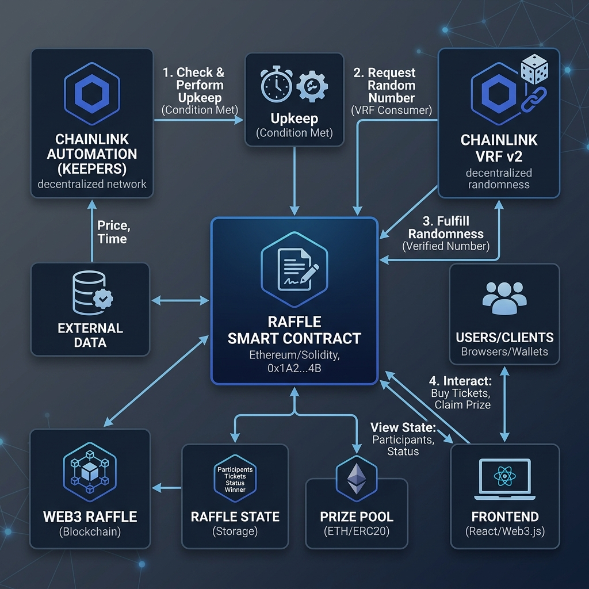

# Raffle — Provably Fair On-Chain Lottery

> A trustless, decentralized raffle contract powered by **Chainlink VRF v2.5** for verifiable randomness and **Chainlink Automation** for autonomous winner selection. No centralized admin can manipulate the outcome — randomness is cryptographically provable on-chain.

---

## Architecture



### Contract Lifecycle

```
1. Deploy Raffle (set entranceFee, interval, VRF params)
        │
2. Users call enterRaffle() and pay entranceFee
        │
3. Chainlink Automation calls checkUpkeep() every block
   → upkeepNeeded = timePassed AND isOpen AND hasBalance AND hasPlayers
        │
4. When conditions met → performUpkeep() called
   → state = CALCULATING, VRF request sent
        │
5. Chainlink VRF calls fulfillRandomWords()
   → winner = players[randomWord % players.length]
   → full balance sent to winner
   → reset: state = OPEN, players = [], timestamp reset
```

---

## Project Structure

```
Raffle/
├── src/
│   └── Raffle.sol              # Core raffle contract
├── script/
│   ├── DeployRaffle.s.sol      # Deployment + config
│   └── HelperConfig.s.sol      # Network config (Sepolia/local)
├── test/
│   ├── unit/
│   │   └── RaffleTest.t.sol    # Unit tests
│   └── integration/            # Fork tests
├── lib/                        # Chainlink + Forge-std
├── foundry.toml
├── Makefile
└── .env
```

---

## Core Logic

### Entrance

```solidity
function enterRaffle() external payable {
    if (msg.value < i_entranceFee) revert Raffle__SendMoreToEnterRaffle();
    if (s_raffleState != RaffleState.OPEN) revert Raffle__NotOpen();
    s_players.push(payable(msg.sender));
    emit RaffleEntered(msg.sender);
}
```

### Upkeep Check (Chainlink Automation)

```solidity
upkeepNeeded = timeHasPassed && isOpen && hasBalance && hasPlayers;
```

All four conditions must be satisfied before a draw is triggered.

### VRF Winner Selection

```solidity
uint256 indexOfWinner = randomWords[0] % s_players.length;
address payable recentWinner = s_players[indexOfWinner];
(bool success,) = recentWinner.call{value: address(this).balance}("");
```

---

## Getting Started

### Prerequisites

- [Foundry](https://book.getfoundry.sh/) installed
- A Chainlink VRF v2.5 subscription (for testnet/mainnet)

### Install Dependencies

```bash
forge install
```

### Set Environment Variables

```bash
cp .env.example .env
# Fill in: SEPOLIA_RPC_URL, PRIVATE_KEY, ETHERSCAN_API_KEY
# Fill in: VRF_SUBSCRIPTION_ID, VRF_KEY_HASH
```

### Build

```bash
forge build
```

### Run Tests

```bash
# All tests
forge test

# With verbosity
forge test -vvv

# Specific test
forge test --match-test testRaffleRecordsPlayersWhenTheyEnter -vvv
```

### Gas Snapshot

```bash
forge snapshot
```

### Deploy to Local Anvil

```bash
# Terminal 1: start local node
anvil

# Terminal 2: deploy
make deploy
```

### Deploy to Sepolia

```bash
make deploy-sepolia
```

---

## Key Features

| Feature | Detail |
|---|---|
| ✅ Verifiable Randomness | Chainlink VRF v2.5 — cryptographically provable |
| ✅ Autonomous Operation | Chainlink Automation triggers draws without any manual call |
| ✅ Trustless | No owner/admin can manipulate winner selection |
| ✅ Custom Errors | Gas-efficient reverts (`Raffle__SendMoreToEnterRaffle` etc.) |
| ✅ State Machine | Prevents entries during winner calculation phase |
| ✅ Configurable | Entrance fee, interval, and VRF params set at deploy time |

---

## Test Coverage

Tests cover:
- Players cannot enter with insufficient fee
- State reverts to `OPEN` after winner is picked
- `checkUpkeep` returns `false` when conditions not met
- VRF callback correctly selects and pays winner
- Events are emitted correctly
- Reentrancy safety on prize transfer

---

## Tech Stack

- **Solidity** `^0.8.19`
- **Foundry** (Forge, Anvil, Cast)
- **Chainlink VRF v2.5** — verifiable random numbers
- **Chainlink Automation** — decentralized keeper network

---

## License

MIT
